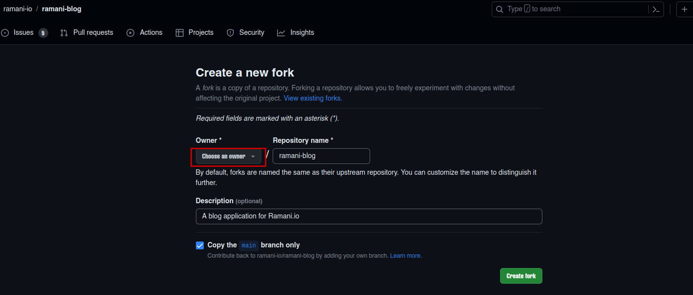
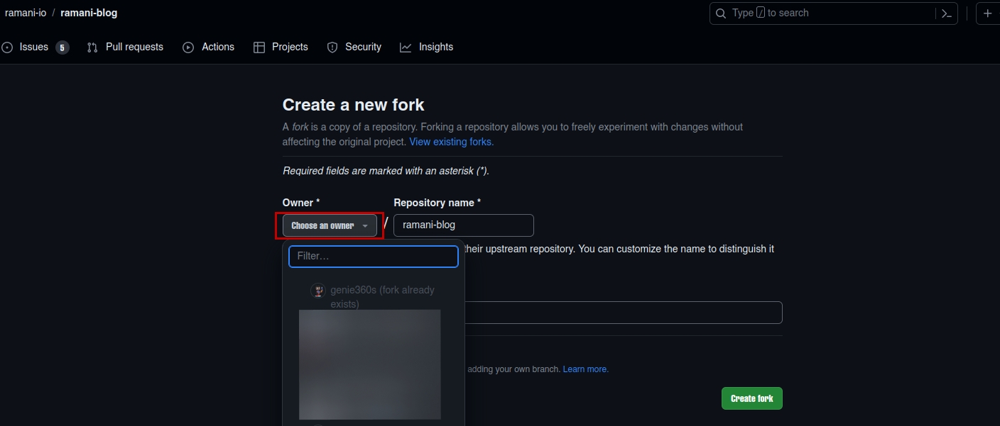
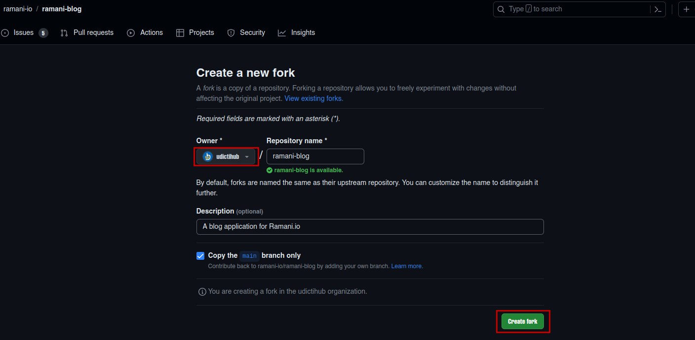
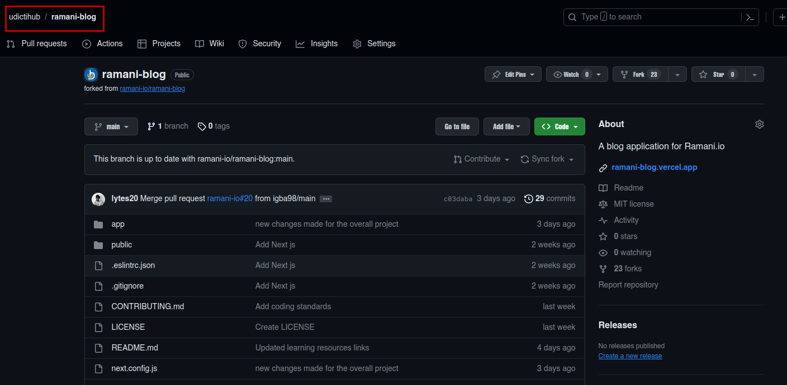
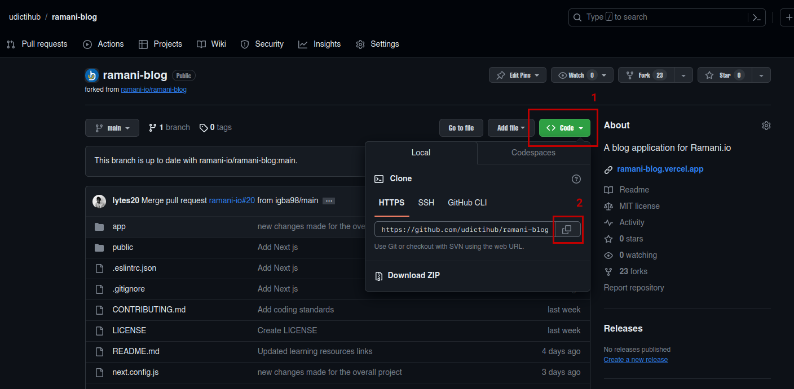

## Hi there 👋🏽 !

# Welcome to Ramani Blog !

Perhaps you are new in contributing to open source , or have some little knowledge. Worry not , we will tale you step by step to ensure that you can contribute to **Ramani Blog** Project.

## How to get started .

1. **Step 1: Forking the Ramani Blog Repository**

After getting to the original Ramani Blog Repository , you will have to look for the forking button , that will be on you right top and click it. But also to verify that you are on the original ramani blog repository , have to check on the top left.

_Refer to the diagrams below_












2. **Step 2: Cloning your forked ramani blog repository into your machine**

After successful forking the ramani repository, you have clone the repository.

**Here is your checklist:**

- [x] Require **Git** a version control in your machine.

- [x] Require an **IDE** for this case we will go with Visual Studio Code

- [x] Require a **personal access token** to give you access to clone your repository into your machine. [How to have a github token.](https://docs.github.com/en/enterprise-server@3.6/authentication/keeping-your-account-and-data-secure/managing-your-personal-access-tokens)

**NB:** _The Tutorial was prepared on a LINUX OS_

Hence , will open the linux terminal ``` Ctrl + Alt + T ``` then :
```bash
 git --version 
 ```
```bash
git clone <the copied url>
```
```bash 
cd ramani-blog
```
```bash 
code . 
```
```bash
 npm install
  ```
```bash 
npm run dev 
```

Then create a new branch to start making changes

```bash 
 git checkout -b <branch-name>
 ```
